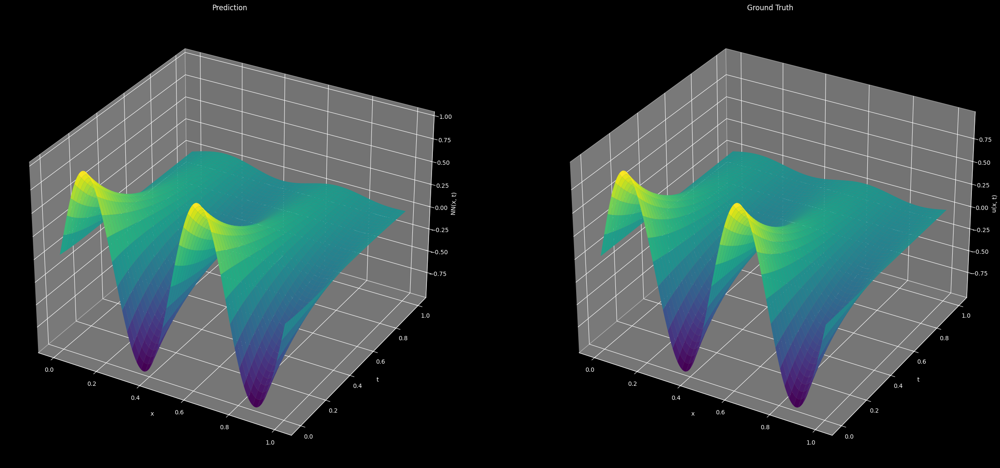
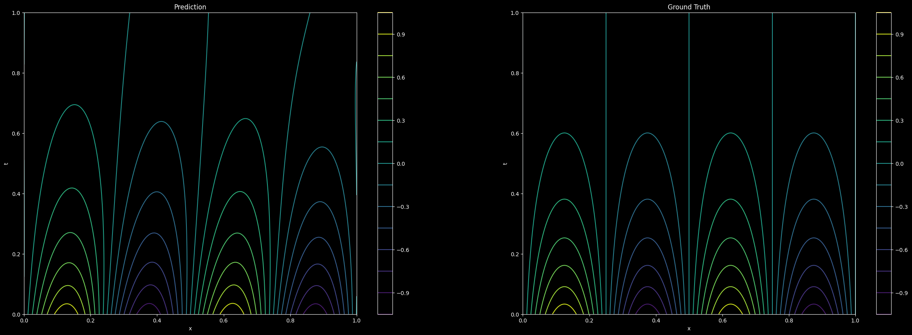

# Heat Solver

Solving 1d heat equation using Physics-informed neural network.

**Heat equation**

$$\frac{\partial u}{\partial t} =k \frac{\partial^2 u}{\partial x^2}$$

$$x\in[0,L]$$
$$t\in[0,1]$$

**Initial and Boundary Conditions**

$$
\begin{align*}
u(x,0) &= f(x) \\
u(0,t) &= 0 \\
u(L,t) &= 0
\end{align*}
$$

**Exact Solution**

$$u(x,t)=\sin\left({4 \pi x}\right) e^{-k\left({4 \pi}\right)^2 t}$$

K (thermal conductivity) is 0.02, L is 1

## Results





## Run

Pytorch support for up to Python 3.11.

```
pip install -r requirements.txt
python3 main.py
```